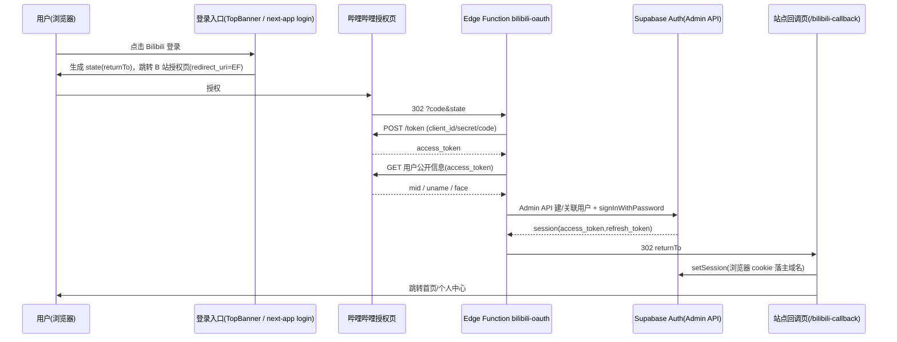

## 用户需求

完成设计稿中尚未实现的「Bilibili 登录」功能，并把登录按钮上的占位表情替换为品牌 Logo：小电视表情替换为哔哩哔哩 Logo，小猫表情替换为 GitHub Logo。当前哔哩哔哩按钮在主站 TopBanner 中处于 `disabled` / "（开发中）" 状态，需要真正打通登录链路。

## 产品概述

为站点补上独立的哔哩哔哩第三方登录能力（Supabase 无原生 Bilibili provider，采用 Edge Function 自定义 OAuth 接入），覆盖主站首页横幅（TopBanner）与 Next.js 应用登录页两处入口；同时统一两处登录按钮的品牌视觉，用 B 站小电视 Logo 与 GitHub Octocat Logo 替代原有 emoji 占位符。凭证暂未申请，先交付可运行代码框架 + 密钥占位 + 开放平台配置清单，填入凭证后即可生效。

## 核心功能

- 哔哩哔哩 OAuth 登录：授权 → 换取 token → 获取用户公开信息（mid/昵称/头像）→ 在 Supabase 建号或关联已有账号 → 站点同域回调落会话。
- 主站 TopBanner 启用 B 站登录按钮（去掉 disabled，绑定处理函数）。
- Next.js 登录页新增 B 站登录按钮，与主站一致。
- 品牌 Logo 替换：TopBanner 与 Next 登录页的小电视表情 → B 站 Logo、小猫表情 → GitHub Logo。
- 资料同步：首次登录写 `profiles`（昵称/头像/邮箱/bilibili_mid），复用现有 RLS 与自动建档触发器。
- 开放平台接入清单：client_id/secret 申请、回调域名白名单、Supabase 密钥配置步骤。

## 技术栈选择

- 后端/鉴权：Supabase（Auth + Edge Functions/Deno + Postgres 迁移）。B 站接入走 **Edge Function 自定义 OAuth**（PKCE 不适用，B 站 token 端点仅返回 access_token）。
- 主站：Docusaurus（React/JS），`src/hooks/useAuth.js` + `src/supabase/supabaseClient.ts`（浏览器端 `@supabase/ssr`，`detectSessionInUrl` 已开启，cookie 落主域名）。
- Next 应用：`apps/next-app`（Next.js + `@supabase/ssr`），浏览器客户端 `@/lib/supabase/client`。
- 图标：[skill:lucide-icons] 获取 `bilibili` 与 `github` 品牌 SVG 内联。
- 配置/部署：[skill:Supabase Ops] 生成迁移、管理 Edge Function、设置密钥。

## 实现方案

### 总体策略

采用「**Edge Function 作 token 交换器 + 站点同域回调页 setSession**」模式，规避跨域 cookie 限制：

1. 前端 `handleBilibiliLogin`：生成随机 `state`（内含 `returnTo` 站点白名单，防开放重定向/CSRF），整页跳转到 B 站授权页，`redirect_uri` 指向 Edge Function 回调。
2. Edge Function `bilibili-oauth`：校验 `state` → 用 `code` 调 `POST https://api.bilibili.com/x/account-oauth2/v1/token` 换 `access_token` → 调「获取用户公开信息」接口拿 `mid/uname/face` → 用 **service_role** 经由 Admin API 建号/关联（email 用稳定唯一值 `bili_{mid}@bilibili.local`，`raw_user_meta_data` 写入 `bilibili_mid/nickname/avatar_url/provider`）→ `signInWithPassword` 换取 session。
3. Edge Function 重定向回站点回调页，token 以 URL fragment（`#access_token=...&refresh_token=...&expires_in=...&token_type=bearer`）传回（fragment 不上送服务器）。
4. 站点回调页：调 `supabase.auth.setSession()` 落 cookie，触发 `syncBilibiliProfile`（镜像现有 `syncGitHubProfile`）写 `profiles.bilibili_mid`，跳转首页/个人中心。

### 关键技术决策与权衡

- **为何 Edge Function 而非 Supabase Custom Provider**：B 站不返回 `id_token`/JWKS，Custom Provider 的签名校验会失败；Edge Function 用 Admin API 完全可控。
- **为何 fragment 而非 ?code**：B 站把令牌回传给我们自己的函数后，我们再交给站点；用 fragment 避免令牌经服务器日志泄露，且浏览器客户端 `detectSessionInUrl` 可直接消费标准 Supabase fragment。
- **账号关联策略**：按 `profiles.bilibili_mid` 查重；已存在则复用同一 auth user（更新 metadata），实现「同账号多次登录一致」，且不破坏现有 GitHub/邮箱账号。
- **复用现有能力**：`handle_new_user()` 触发器会在 Admin 建号时自动建 `profiles` 行；`onAuthStateChange` 会自动触发资料同步，降低新代码量。

### 性能与可靠性

- Edge Function 仅做必要网络调用（token + userinfo + 一次 Admin upsert），无重计算；B 站 fetch 加 `AbortSignal.timeout(8000)` 防挂起（参考 getWeather 函数）。
- 密钥缺失时函数返回明确错误 JSON 而非崩溃（框架模式友好）。
- `bilibili_mid` 加唯一索引，关联查询 O(1)；avatar_url 沿用现有 `AVATAR_CACHE` 机制。

## 实现注意（基于探索结论）

- 主站浏览器客户端 `src/supabase/supabaseClient.ts` 已 `detectSessionInUrl:true` 且 cookie 落主域名 → 回调页 `setSession` 后主站与 `/app` 天然共享登录态，无需额外 domain 处理。
- `profiles` RLS：公开 SELECT + `auth.uid()=id` 的 INSERT/UPDATE 已就绪；新增列后同步逻辑可用现有策略，无需新 RLS。
- Edge Function 需新增 `@supabase/supabase-js` 到 `deno.json` imports，用 `Deno.env.get('SUPABASE_SERVICE_ROLE_KEY')` 建 Admin 客户端（`persistSession:false`）。
- `state` 必须校验 `returnTo` 落在白名单（主站 origin + next-app origin），杜绝开放重定向。
- 实现时确认 B 站「网页应用接入」授权精确 URL 与「获取用户公开信息」接口 URL/字段（openhome 文档），并以 `state` 携带 `returnTo`。
- 文件写入逐个顺序执行，勿并行写多文件（项目约定）。

## 架构设计



## 目录结构

```
supabase/
├── migrations/
│   └── 20260720_bilibili_login.sql      # [NEW] profiles 新增可空唯一列 bilibili_mid + 唯一索引(WHERE NOT NULL)；IF NOT EXISTS 兜底，保持幂等。
├── functions/
│   └── bilibili-oauth/
│       ├── index.ts                     # [NEW] Edge Function：state 校验→换 token→取用户信息→Admin 建/关联用户→signInWithPassword→302 带 fragment 回 returnTo。密钥缺失时返回友好错误。
│       └── deno.json                    # [NEW] import map：@supabase/supabase-js、@supabase/functions-js、@supabase/server。
└── config.toml                          # [MODIFY] 新增 [functions.bilibili-oauth] 条目(enabled=true, verify_jwt=false, entrypoint)。

src/
├── hooks/useAuth.js                     # [MODIFY] 新增 handleBilibiliLogin（构造 state/returnTo 并跳转 B 站授权页）、syncBilibiliProfile（镜像 syncGitHubProfile 写 bilibili_mid）；对外暴露。
├── components/TopBanner/index.js        # [MODIFY] B 站按钮去掉 disabled、绑定 handleBilibiliLogin、📺→内联 B 站 Logo SVG；GitHub 按钮 🐱→内联 GitHub Logo SVG；保留 loginTheme 配色与 hover 逻辑。
├── pages/bilibili-callback.js           # [NEW] 主站回调页：解析 location.hash → supabase.auth.setSession() → 触发资料同步 → 跳转首页/个人中心。
└── data/siteData.json                   # [MODIFY] texts.buttons.bilibiliLogin 由「Bilibili 登录（开发中）」改为「Bilibili 登录」。

apps/next-app/
├── app/login/page.tsx                   # [MODIFY] 新增 B 站登录按钮(handleBilibiliLogin + B 站 Logo)、GitHub 按钮加 GitHub Logo；复用现有 supabase 浏览器客户端。
└── app/bilibili-callback/page.tsx       # [NEW] Next 回调页(客户端组件)：解析 hash → setSession → 跳转 /app/profile。

docs/
└── bilibili-oauth-setup.md              # [NEW] 开放平台申请 client_id/secret、配置回调白名单(${SUPABASE_URL}/functions/v1/bilibili-oauth/callback)、Supabase CLI 设置 BILIBILI_CLIENT_ID/SECRET 密钥的步骤清单。
```

## 关键代码结构

```typescript
// Edge Function 入口签名（Deno + serve）
serve(async (req: Request) => {
  // GET /functions/v1/bilibili-oauth/callback?code=CODE&state=BASE64({returnTo})
  // 1. 校验 state.returnTo ∈ 白名单
  // 2. POST api.bilibili.com/x/account-oauth2/v1/token {client_id, client_secret, grant_type:'authorization_code', code}
  // 3. GET 用户公开信息(Bearer access_token) → { mid, uname, face }
  // 4. admin.upsertUserById / createUser({ email:`bili_${mid}@bilibili.local`, user_metadata:{bilibili_mid:mid, nickname:uname, avatar_url:face, provider:'bilibili'}, password:<random> })
  // 5. signInWithPassword({email, password}) → { access_token, refresh_token, expires_in }
  // 6. return Response.redirect(`${returnTo}#access_token=...&refresh_token=...&expires_in=...&token_type=bearer`)
});

// 回调页统一消费标准 Supabase fragment
await supabase.auth.setSession({ access_token, refresh_token });
```

## Agent Extensions

### Skill

- **lucide-icons**
- 用途：获取 `bilibili` 与 `github` 品牌 SVG 图标，用于替换 TopBanner 与 Next 登录页中的小电视/小猫 emoji。
- 预期结果：下载到可用的 B 站小电视 Logo 与 GitHub Logo SVG 路径/组件，内联进按钮 JSX/TSX，统一 24×24 尺寸与现有按钮配色协调。
- **Supabase Ops**
- 用途：生成 `profiles.bilibili_mid` 迁移 SQL、创建并配置 `bilibili-oauth` Edge Function（config.toml + deno.json + secrets 占位）、管理密钥。
- 预期结果：可部署的迁移与 Edge Function 代码；密钥 `BILIBILI_CLIENT_ID`/`BILIBILI_CLIENT_SECRET` 配置说明就绪，框架模式下函数对缺失密钥给出友好提示。