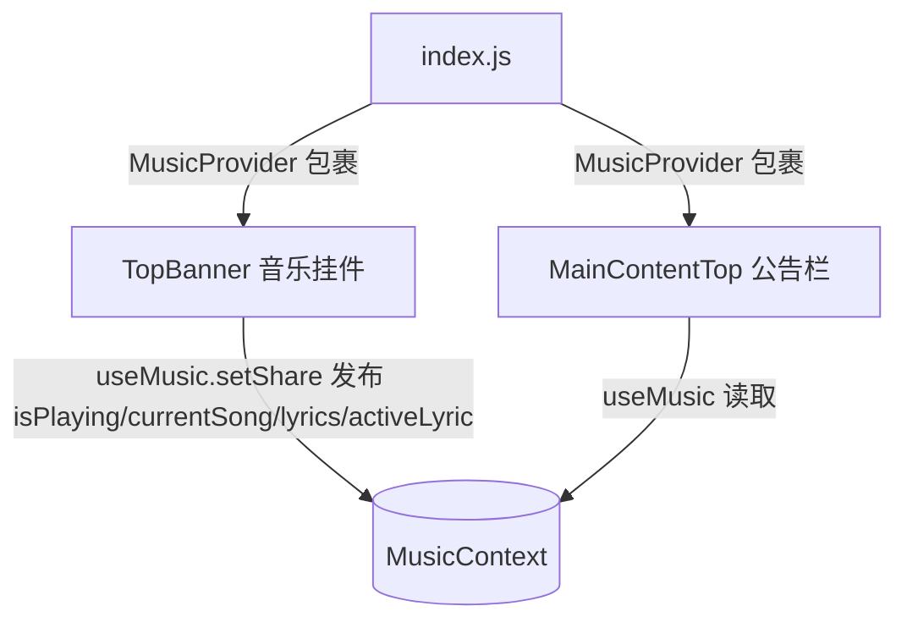

## 用户需求

将音乐歌词功能从顶部音乐挂件（TopBanner）移入首页公告栏（MainContentTop）。音乐播放时，公告栏显示当前歌词行；未播放时，公告栏恢复原公告跑马灯。

## 产品概述

首页公告栏目前以横向滚动跑马灯展示公告文案（`texts.notification`）。本改动让公告栏与音乐播放状态联动：播放音乐时，公告栏变为居中静态显示当前歌词行；暂停或停止时，恢复公告跑马灯显示。原音乐挂件内的「词」按钮与展开歌词面板一并移除，歌词只在公告栏呈现。

## 核心功能

- 新建轻量 MusicContext，跨兄弟组件（TopBanner 与 MainContentTop）共享播放状态与歌词数据
- TopBanner 在播放状态/进度/曲目变化时，将 `isPlaying / currentSong / lyrics / activeLyric` 写入 context，并移除内部「词」按钮与歌词展开面板
- MainContentTop 读取 context：播放且有歌词行时居中静态显示当前歌词；否则显示原公告跑马灯
- 暂停、无歌词、加载中、空列表等场景回退为公告显示
- 确保 admin 后台可改歌单 ID：保留并突出 `music.songIds`（list 类型，admin.js 已支持）
- 移除本地播放（local MP3）模式，仅保留 netease 网易云

## 技术栈

- 框架：Docusaurus（React，Inferno/React 组件式），与现有 `src/components`、`src/pages` 一致
- 状态共享：React Context（无第三方依赖，符合仓库现有纯 React 模式）
- 数据源：复用现有 `src/components/TopBanner` 已解析的 `currentSong.lyrics`（netease 模式经 `/api/music` 一并返回，含 `parseLrc` 解析结果）

## 实现方案

### 总体策略

采用 React Context 在首页层级（仅 `src/pages/index.js` 同时渲染这两个兄弟组件）打通播放状态与公告栏。TopBanner 作为状态发布方，MainContentTop 作为订阅方，避免 props 透传与全局事件污染。

### 关键技术决策

1. **新建 `src/utils/musicContext.js`**：导出 `MusicContext`、`MusicProvider`、`useMusic`。Provider 持有 `{ isPlaying, currentSong, lyrics, activeLyric }` 并暴露 setter。这是最小、可扩展的共享方案，后续若其他组件（如主题切换、侧边栏）想读播放状态也可复用。
2. **TopBanner 发布状态**：保留内部全部播放/进度逻辑，仅新增一个 `useEffect`，依赖 `isPlaying / currentTime / currentIndex / playlist / mode`，把 `{isPlaying, currentSong, lyrics, activeLyric}` 同步到 context。加载中（isLoading）与空列表（playlist.length===0）分支不变，但额外确保 context 写入 `isPlaying=false`，避免残留播放态。
3. **移除挂件内歌词 UI**：删除 `lyricsOpen` 状态、`词` 按钮（L330-338）、`lyricsOpen` 展开面板（L340-350），以及不再需要的 `lyricsLoading` 发布（保留内部 state 无害，但不再渲染）。
4. **MainContentTop 条件渲染**：公告栏容器保留原高度 40、背景 `#E3F2FD`、文字 `#004085` 样式。播放且 `lyrics[activeLyric]` 存在时，改为居中静态文本 `lyrics[activeLyric].text || '♪'`，并停用跑马灯动画；否则维持原跑马灯公告。

### 性能与可靠性

- Context 更新仅在播放进度变化时触发（每 `timeupdate` 一次），频率低（~4/s），渲染范围仅限公告栏一行文本，开销可忽略。
- `activeLyric` 计算复用 TopBanner 现有逻辑（O(n) 线性扫描，n 为歌词行数，极小），无需优化。
- 回退安全：context 初始值 `isPlaying=false`、歌词 null，未播放/无歌词一律显示公告，不会白屏。

## 新增需求：admin 改歌单 ID + 移除本地播放

### A. admin 后台可改歌单 ID（music.songIds）

- `src/config/adminConfigSchema.js` 的「首页板块开关」组已含 `music.songIds`（type:'list'，admin.js L481/L73 已支持文本↔数组互转）。
- 调整：将 `music.mode` 的 select 选项仅保留 `netease`（删除 `local` 选项，因为本地播放将被移除），help 文案同步去掉 local 说明；保留 `music.songIds` 与 `music.playlistId` 字段，使后台可直接编辑歌单/歌曲 ID 并即时生效（`SiteConfigProvider.applySiteConfig` 按点路径合并进 siteData）。
- 验证：admin 页面「首页板块开关」分组中 `music.songIds` 行存在且可编辑、保存后首页生效。

### B. 移除本地播放（local MP3）模式

- `src/components/TopBanner/index.js`：
- `MusicWidget` 中 `const mode = music.mode || (music.playlistId ? 'netease' : 'local');`（L113）改为硬编码 `const mode = 'netease';`（或恒走 netease 分支）。
- 播放列表 `useEffect`（L132-200）：删除 `else`（local 分支 L178-197）及 `mode` 判断，仅保留 netease 分支；依赖数组移除 `mode` 与 `JSON.stringify(music.mp3List || [])`。
- L511-513 顶部挂件显隐条件中的 `|| (Array.isArray(siteData?.music?.mp3List) && ...mp3List.length)` 移除，仅依据 `playlistId` / `songIds` 显隐。
- 文件头注释（L88-90）更新为仅 netease。
- `src/data/siteData.json`：删除 `music.mp3List` 数组（L186 起）。
- 说明：app 端（next-app）不使用 TopBanner，不受影响。

## 实现要点（防回归）

- 保持 `MainContentTop` 现有配色与容器样式，仅切换内层内容（跑马灯 span ↔ 居中 span），不要改动外层布局与 `isMobile` 响应式逻辑。
- `TopBanner` 的 `parseLrc`、播放控制、api 拉取逻辑完全不动，仅做状态「上行」发布与 UI 裁剪，降低回归面。
- 移除 `lyricsOpen` 引用时需同步删除其 `useState` 声明（L127），避免未使用变量 lint 报错。
- `about.js` 仅将组件名作为字符串列出，不渲染，无需改动。

## 架构设计

首页 `index.js` 用 `MusicProvider` 包裹 `TopBanner` 与 `MainContentTop`：



TopBanner 内部状态（isPlaying、currentTime、currentSong、activeLyric）保持不变，仅向 context 上行同步。

## 目录结构

```
src/
├── utils/
│   └── musicContext.js          # [NEW] MusicContext + MusicProvider + useMusic。持有 {isPlaying, currentSong, lyrics, activeLyric} 及 setter，供 TopBanner 发布、MainContentTop 订阅。
├── pages/
│   └── index.js                 # [MODIFY] 导入 MusicProvider，用其包裹 <TopBanner> 与 <MainContentTop>，使二者共享同一 context。
└── components/
    ├── TopBanner/
    │   └── index.js             # [MODIFY] 用 useMusic() 获取发布函数；新增 useEffect 同步播放状态到 context；移除 lyricsOpen 状态、词按钮、歌词展开面板（保留播放/进度/Lrc 解析逻辑）。
    └── MainContentTop/
        └── index.js             # [MODIFY] 用 useMusic() 读取状态；公告栏容器条件渲染：播放且有歌词→居中静态当前歌词行（停跑马灯）；否则→原公告跑马灯。
```